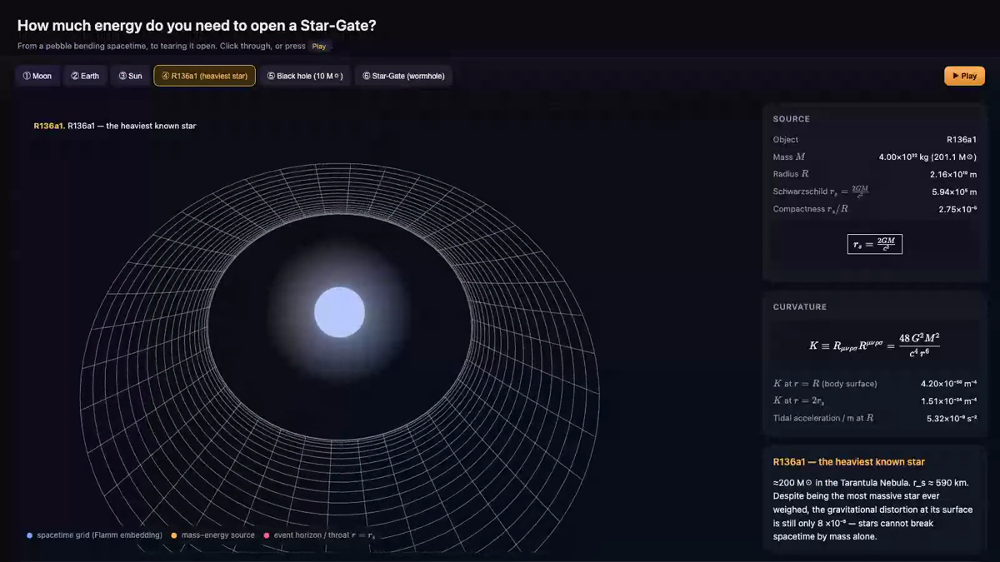

# How Much Energy Do You Need to Open a Star-Gate?

> A physically-accurate, interactive lesson in General Relativity — from a moon dimpling spacetime to the energy required to tear it open for a traversable wormhole.

**Created by Eugene Nayshtetik · MIT-licensed**



## What this is

A small Flask app that renders the **Schwarzschild geometry** (Flamm's paraboloid embedding) as a classic wireframe spacetime well, with a glowing body sphere resting in the deformation. Six narrative scenes step through real masses — Moon, Earth, Sun, R136a1 (the heaviest star known), a 10 M☉ black hole — and finish with an **Einstein–Rosen bridge** (traversable wormhole). A live panel computes the **classical** ($\,|E|\sim c^4 b_0/G$) and **quantum lower-bound** ($|E|\gtrsim\hbar c/b_0$) energy required to open a Star-Gate, with comparisons to everyday quantities (Hiroshima bombs, all nukes on Earth, Jupiter-rest-energies, etc.).

A separate pipeline generates a narrated demo video: neural TTS (Piper), cinematic auto-camera, royalty-free orchestral score, plus AI-generated sci-fi intro and outro shots from Grok Imagine.

## Live formulas shown

- **Schwarzschild radius**: $r_s = 2GM/c^2$
- **Kretschmann scalar** (vacuum curvature): $K = R_{\mu\nu\rho\sigma}R^{\mu\nu\rho\sigma} = 48G^2M^2/(c^4r^6)$
- **Tidal acceleration per metre** at $R$
- **Einstein field equations**: $G_{\mu\nu} = 8\pi G/c^4 \cdot T_{\mu\nu}$
- **Morris–Thorne wormhole energy** (classical and Ford–Roman bounds)

## Run it locally

```bash
git clone https://github.com/Skabber2000/einstein-stargate
cd einstein-stargate
python -m venv .venv && source .venv/bin/activate
pip install -r requirements.txt
python app.py     # → http://127.0.0.1:5000
```

Open the page and click through the six narrative buttons (① Moon → ⑥ Star-Gate), or press **▶ Play** to autoadvance with cinematic camera.

## Regenerate the demo video

The repo ships with the prerendered MP4 in `demo/build/spacetime_full.mp4` (Git LFS, 109 MB, lossless H.264/AAC). To rebuild it from scratch:

```bash
# 1. Install neural TTS voice (~115 MB ONNX model from Hugging Face)
bash scripts/install_voice.sh

# 2. Install Playwright Node SDK (one-time)
npm install playwright

# 3. Make sure the app server is running
python app.py &

# 4. Render the main narrated walkthrough
node demo/make_demo.cjs              # → demo/build/spacetime_demo.mp4

# 5. Splice intro + main + outro with title overlays + music
bash demo/assemble.sh                # → demo/build/spacetime_full.mp4
```

To regenerate the **Grok Imagine** intro / outro clips, copy `.env.example` → `.env` and paste your `XAI_API_KEY`, then submit a request to `POST https://api.x.ai/v1/videos/generations` with `model: grok-imagine-video` (the pipeline already does this — see prompts at the top of the script).

## Architecture

```
einstein-stargate/
├── app.py                              # Flask server (computes physics, serves the page)
├── requirements.txt
├── templates/index.html                # Single-page UI
├── static/
│   ├── css/app.css
│   ├── js/app.js                       # Three.js scene, geometry, camera, physics
│   └── img/reference.png
├── demo/
│   ├── script.json                     # 8-block narration script
│   ├── make_demo.cjs                   # Piper TTS + Playwright recording
│   ├── assemble.sh                     # FFmpeg concat with crossfades + music bed
│   ├── fonts/                          # Cinzel, Roboto (SIL OFL / Apache 2.0)
│   ├── music/Aces_High.mp3             # Kevin MacLeod, CC-BY 4.0 — see CREDITS.md
│   ├── overlays/                       # Title PNGs generated with Pillow
│   ├── voices/                         # Piper ONNX voice (download via script)
│   ├── grok/                           # Grok Imagine intro / outro clips
│   └── build/spacetime_full.mp4        # Final rendered video (Git LFS)
└── scripts/install_voice.sh
```

## Tech stack

| Layer        | Tool                                          |
|--------------|-----------------------------------------------|
| Backend      | Flask 3                                       |
| 3D rendering | Three.js 0.160 (ES modules from CDN)          |
| Math         | KaTeX                                         |
| TTS          | [Piper](https://github.com/rhasspy/piper) `en_US-ryan-high` neural ONNX voice |
| Screen capture | Playwright (Chromium, headless)             |
| Audio/Video  | FFmpeg (libx264, AAC, xfade, amix)            |
| Title cards  | Python Pillow (Gaussian-halo overlay PNGs)    |
| AI video     | xAI Grok Imagine Video                        |
| Music        | "Aces High" — Kevin MacLeod (incompetech.com) |

## License

MIT — see [LICENSE](LICENSE).

Bundled third-party assets retain their original licenses; see [CREDITS.md](CREDITS.md).
